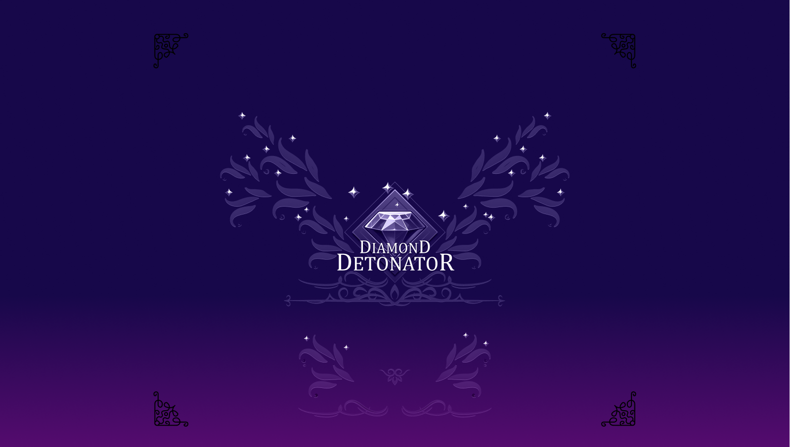
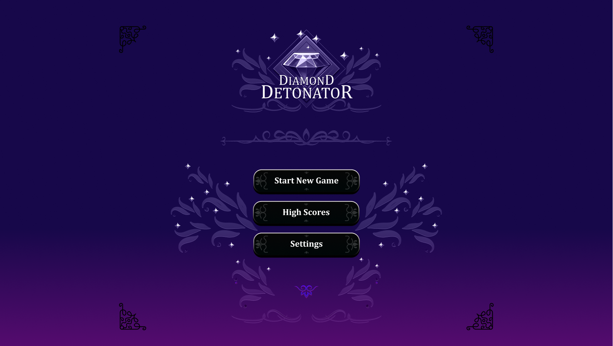
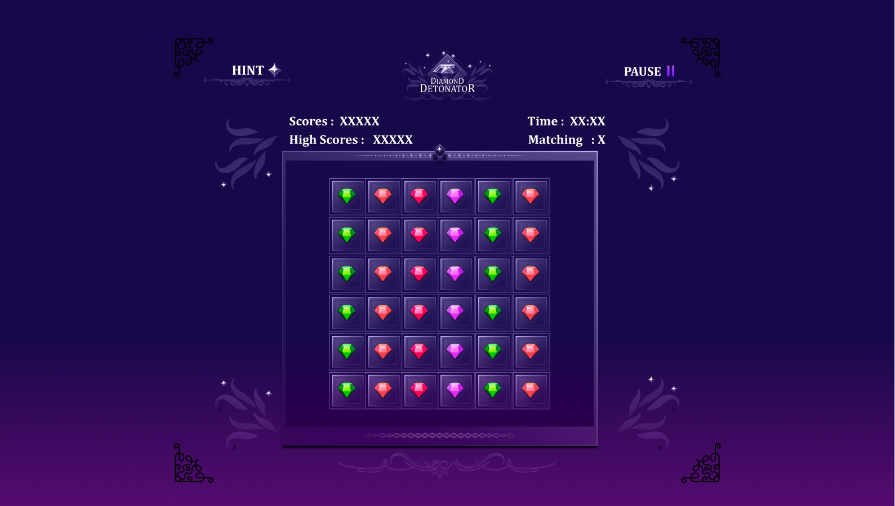
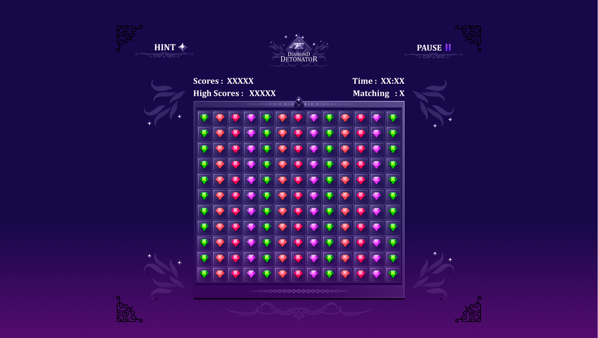
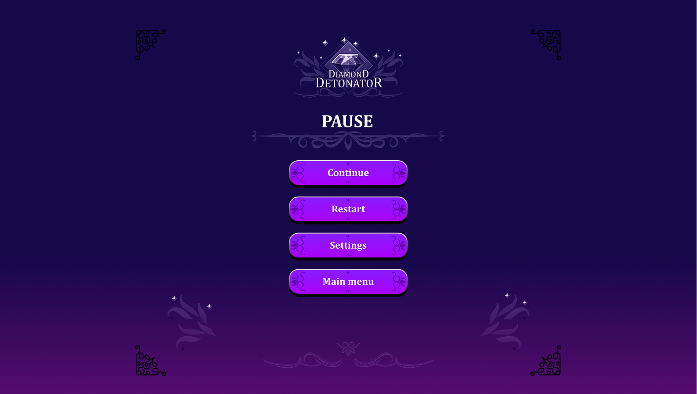
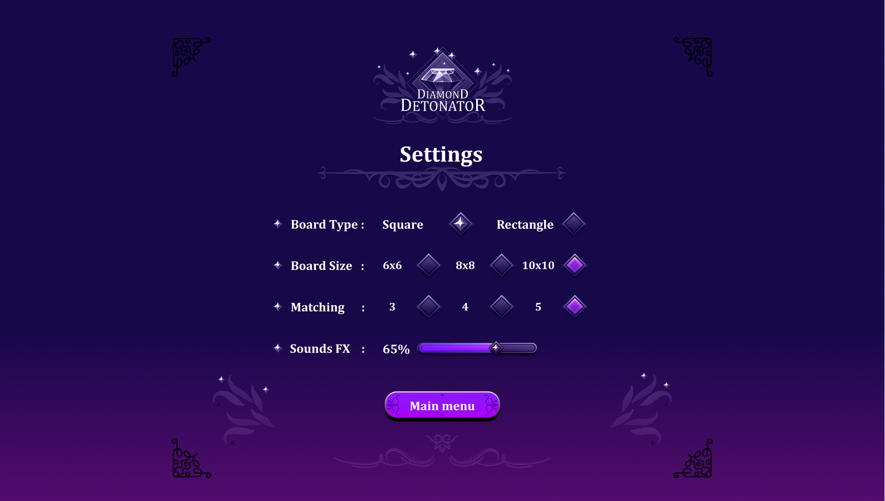
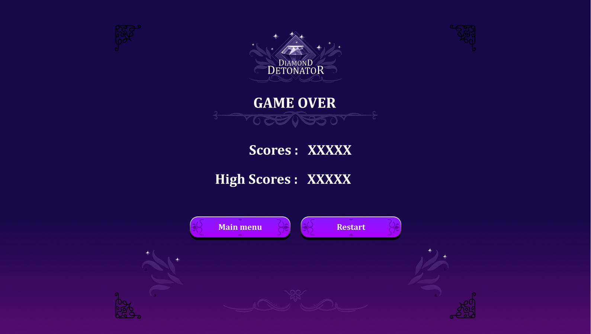

# Diamond Detonator

Diamond Detonator is a fast, strategic twist on the classic match-3. Built with Python + Pygame and a sleek gothic UI from Figma, it lets you choose match sizes (3–5) and play across multiple board layouts. Trigger chain reactions with Special Diamonds that clear all gems of their color, rack up combo scores, and chase your personal best with local high scores (SQLite). Hints, pause, and sound toggles keep it friendly for quick sessions or deep runs—how big can you detonate?


## Screenshots














## Demo
Watch the full gameplay demo on [YouTube](https://youtu.be/a-OIm_v7aKQ?si=JcbmYsfSCMUijPKm).


## Features
- Match-any size: Choose 3, 4, or 5-in-a-row for different challenge levels.

- Special Diamonds: Trigger color-clears and chain reactions for huge combo scores.

- Combo & Multiplier System: Back-to-back detonations ramp your multiplier.

- Multiple Board Layouts: Swap between curated grids for fresh pacing.

- Smart Hints: Optional move suggestions when you’re stuck.

- Power-Up Ready: Framework in place for future boosters (row/column blasts, etc.).

- Local High Scores: SQLite-backed leaderboard to track personal bests by name.

- Flexible Controls: Mouse/trackpad drag-and-swap; keyboard shortcuts for UI.

- Polished UX: Pause, restart, and toggle sound/music in-game.

- SFX & Music: Crisp audio cues for matches, detonations, and milestones.

- Responsive Performance: Smooth animations with Pygame on modest hardware.

- Clean Save/Load: Persists settings (audio, match size, layout) between sessions.


## Tech Stack
- **Language:** Python
- **Framework:** Pygame
- **Database:** SQLite (local high score storage)
- **Design:** Figma (UI/UX layout and assets)
- **Platform:** Desktop (Windows/macOS/Linux)


# Requirements

- Python 3.9+
- Pygame 2


# Installation

On Linux of MACOS, Python3 is preinstalled. On Windows, Download the latest version of Python3 from the official website and install it. Make sure you check the "Add Python3 to path" box at the start of the installation.

On Linux or MACOS, open a terminal. On Windows open CMD. Execute the following command to install Pygame

```bash
pip3 install pygame
```


# Run the game

You can double click on `diamondDetonator.py` or run the following command from the terminal

```bash
python3 diamondDetonator.py
```